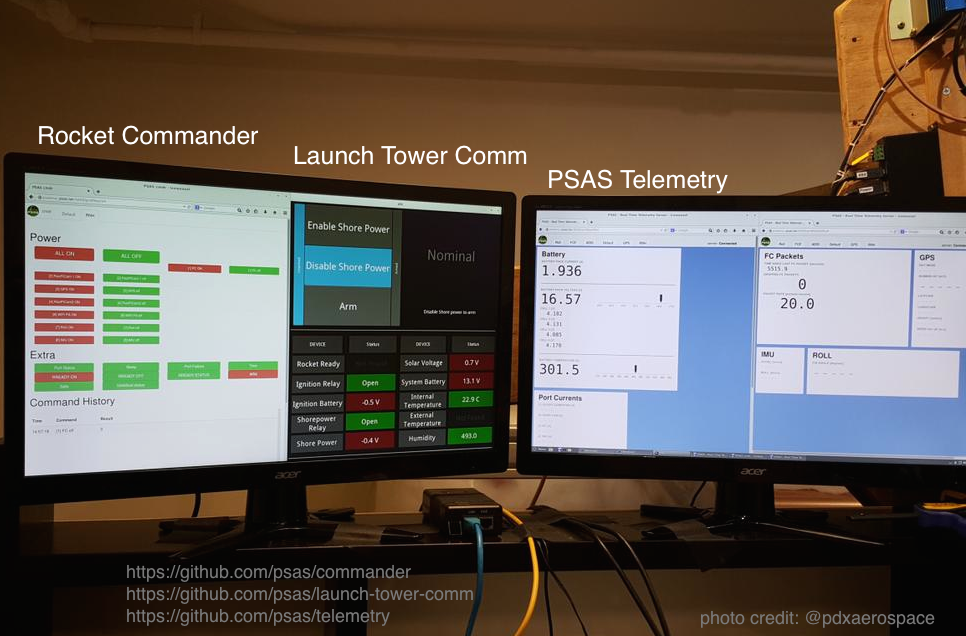

# Launch Tower Comm



Launch Tower Comm is the Portland State Aerospace Society's launch tower 
control.

It is run by [Kivy](http://kivy.org), a multi-touch GUI framework, and 
[Phidgets](https://www.phidgets.com), "Unique and Easy to Use USB Interfaces."

[Portland State Aerospace Society](https://psas.pdx.edu)

---

# Getting Started (Debian)

## Dependencies

### Phidget22

In order to connect to the phidget devices you will need to install [Phidget22](https://www.phidgets.com).

Go to the [installation page](https://www.phidgets.com/docs/OS_-_Linux) and make sure to select package install -> install script -> *Non-root* (This is very important and is not selected by default!)

After that follow the instructions to set up the udev rules.

#### Additional Phidget22 Packages

The following phidget packages are recommended but not required
- [phidget22admin](https://www.phidgets.com/docs/Phidget22admin_Guide): Very helpful to list information about connected devices on the command line, among other things.
- phidget22networkserver + libphidget22extra: the beaglebone should have the server on it already, but for debugging purposes these may be helpful to have on your device as well.

### Python Packages

cd into the same directory as the project's `pyproject.toml` file and run

```bash
pip install .[dev]
```

note: You may need to replace the above with `pip install ".[dev]"` if not using bash because of the brackets.

If kivy gives you problems after this point, try installing the [source dependencies](https://kivy.org/doc/stable/installation/installation-linux.html#linux-ppa).
Kivy claims this is not required, but we have solved issues by doing this in the past.

## Starting Up The GUI

- Plug in the LTC power supply and turn it on. Flip the switches behind the door labeled "Bell" to the on position.
- Make sure the beaglebone is plugged into the interface kit (usb).
- Connect via wifi or ethernet to the beaglebone.
- Run the following command:

```bash
./launch-tower-comm/ltc.py
```

The gui should open up and the Phidgets should be displaying their information.

## SSH into the Beaglebone

If you ever need to get into the Beaglebone to perform maintenance or to configure the network server, the easiest way is to plug directly in via ethernet, wait for the connection to set up, and run

```bash
ssh debian@10.0.0.1
```

Follow any prompts that pop up and enter the password "temppwd" and then you should be logged in to the shell.
